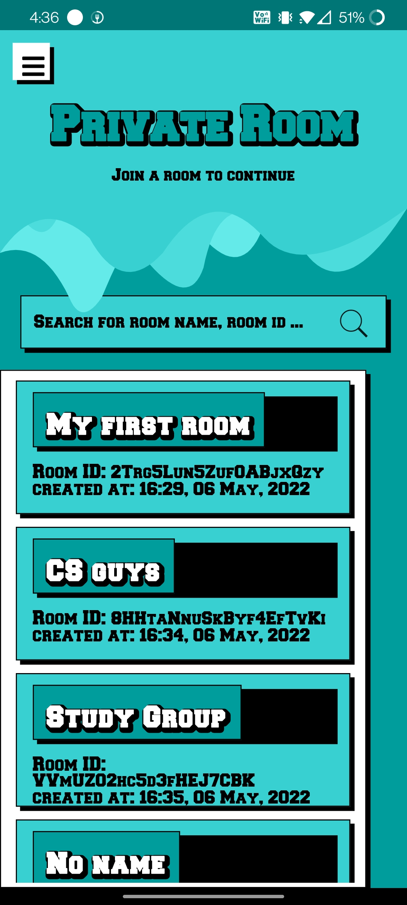
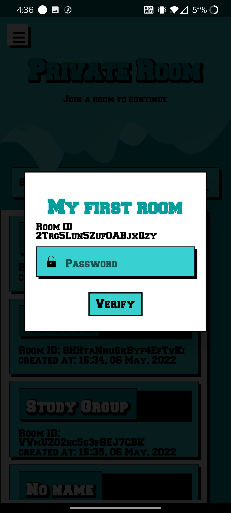
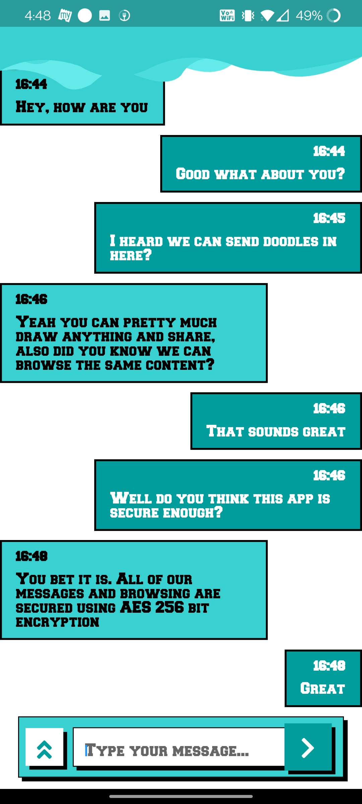
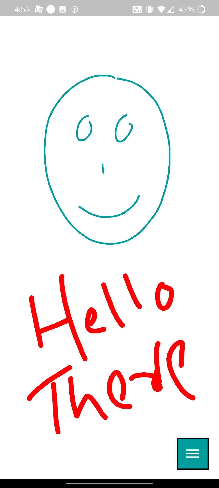
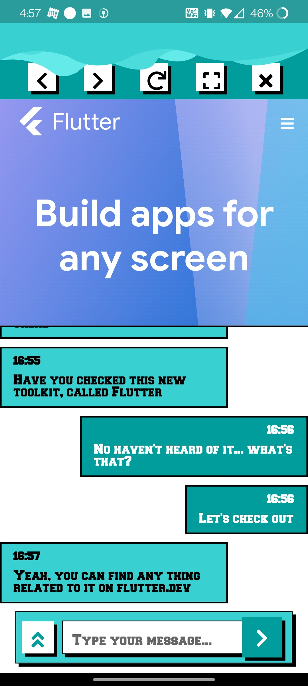
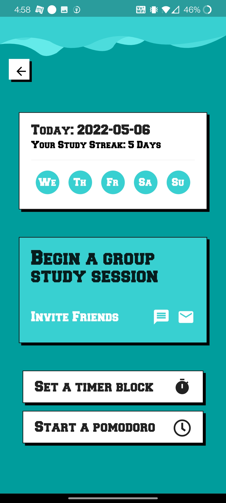
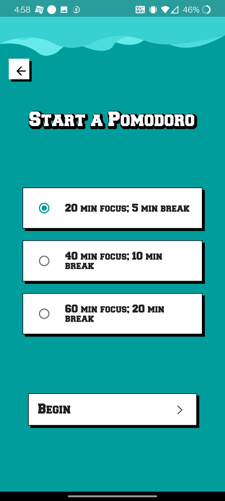

<p align= "center"></p>
 
<div align="center">
	


<br>


Private Room is a retro theme-based secured end-to-end encrypted messaging application built using Flutter and Firebase. Provides 256 bit AES encryption to all your messages and browsing.
	
Implemented with additional features like in-sync web browsing and doodle sharing. There's a demonstration of the working to the right ⟶

<br>

<h1><b>Building “Private Room”</b></h1>
	
<div align="left">
<h3>How to implement end-to-end-encryption?</h3>

Our Private Room uses 256-bit AES for securely transmitting and storing our messages in Firebase.

Broadly, we need 3 things for AES to work, most importantly — an encryption password, an Initialization Vector (IV), and our data which needs to be encrypted. The best practice suggests we never use the same combination of the encryption password and IV. To solve this problem, we will take advantage of Firestore’s document ID’s. For every new message node, Firestore generates a unique document ID. We feed this ID to our encrypter as the IV.

Each message node is a `Map<String, dynamic>` type, but to encrypt them together, the map object is converted into a JSON string using `jsonEncode(data)` method from the `dart:convert` class. This JSON string is then uploaded to Firestore.

On the other end, after receiving the encrypted JSON string, it is decrypted using the same password, and using the `jsonDecode(jsonData)` method the string is converted back into the map object.
	
The EncodingDecodingService class takes care of the encoding and encryption of data. The EncryptionService class is used by this class internally for encryption and decryption.

```shell
class EncodingDecodingService {
  static String encodeAndEncrypt(
      Map<String, dynamic> data, String ivPassword, String password) {
    String encodedString = jsonEncode(data);

    return EncryptionService.encrypt(ivPassword, password, encodedString);
  }

  static Map<String, dynamic> decryptAndDecode(
      String data, String ivPassword, String password) {
    String decryptedString =
        EncryptionService.decrypt(ivPassword, password, data);

    return jsonDecode(decryptedString);
  }
}
```

<br>
	
<h3>Our next challenge is to use a shared encryption password between two users.</h3>
We achieve this by making the encryption password as the entry password for our room. But then, how do we validate the entry password without storing it on Firebase?

Whenever a room object is created, the following data are stored in Firestore:

```shell
encryptedRoomId: TOhnsulxEbxwDoP+JZm7ZPNs22SUOsh8xp9diiTzZj8=
roomCreationDate: 09:11, 14 June, 2020
roomId: I77KDrlwYqhSCw5rTC6E
roomName: Secure Room
```
The `roomId` is the Firestore Document ID itself, we encrypt this id using the password provided by the user while creating the room and store the encrypted data as the `encryptedRoomId` field.

And for validation, when a user tries to enter the room, we just try decrypting the `encryptedRoomId` using the provided password, and if the decryption is successful and the decrypted data matches the `roomId` then that user is validated.

We use the encrypt flutter package for implementing all of our encryptions.
	
<br>
	
<h3>Adding a Drawing Screen in Flutter App using CustomPainter.</h3>

The DrawingScreen is implemented using Custom Painter.
	
The background color, pen stroke size and the pen color are all customizable. And at the end, the entire canvas can be converted into bytes of PNG image and uploaded to Firestorage.
	
<br>
	
<h3>And, in here, let’s talk about extracting the image from the canvas.</h3>
	
We have used `PictureRecorder` to record the canvas. Our Painter class extending from the `CustomPainter` class overrides the `void paint(Canvas canvas, Size size)` method. And we need to call this method from the DrawingScreen widget so that we can pass our own canvas, upon which `PictureRecorder` is binded.

```shell
_canvas.drawColor(backgroundColor, BlendMode.srcOver);
var _painter = Drawing(points: _points)..paint(_canvas, availableSize);
```
The `generateImage()` method ends the recording and converts the `Picture` object to an PNG image bytes and we send back the `Uint8List` of bytes to the parent activity, which then gets uploaded to Firestorage and the returned URL is put on the Firestore and send as an usual encrypted message.

```shell
void generateImage() async {
  final picture = _recorder.endRecording();

  final imageWidth = (availableSize.width * dpr).toInt();
  final imageHeight = (availableSize.height * dpr).toInt();

  final img = await picture.toImage(imageWidth, imageHeight);
  final pngBytes = await img.toByteData(format: ImageByteFormat.png);
  Uint8List imageBytes = Uint8List.view(pngBytes.buffer);

  Navigator.of(context).pop(imageBytes);
}
```

<br>
	
<h3>Implementing an in-app browser that is synced accross all the users</h3>
	
The Browser is implemented using webview_flutter package. And the web URL is shared using Firebase Realtime Database. The `bindUrl(WebViewController controller)` method binds the browser to the URL at path ` /firebase-database/{room-id}/visitUrl ` and an `onChildChanged` listener is set at that database path reference, so whenever a new URL is available, the broswer loads that URL.

```shell
void bindUrl(WebViewController controller) {
  ref.child(widget.roomId).onChildChanged.listen((event) {
    String encryptedUrl = event.snapshot.value;
    String url = getDecryptUrl(encryptedUrl);
    controller.loadUrl(url);
  });
}
```
	
And in the `WebView` widget we have implemented the `onPageStarted` function as follows:

```shell
onPageStarted: (url) {
  String encryptedUrl = getEncryptedUrl(url);
  ref.child(widget.roomId).child(kVisitUrl).set(encryptedUrl);
}
```

which basically writes the new URL to the database reference, whenever a new URL is visited.
	
<br>

<h2 align= "left"><b>Here's some Sneak Peek🧐</b></h2>

<p align= "center">&ensp;&ensp;&ensp;&ensp;&ensp;&ensp;&ensp;&ensp;</p>
<p align= "center">&ensp;&ensp;&ensp;&ensp;&ensp;&ensp;&ensp;&ensp;</p>
<p align= "center">&ensp;&ensp;&ensp;&ensp;&ensp;&ensp;&ensp;&ensp;</p>
<p align= "center">&ensp;&ensp;&ensp;&ensp;&ensp;&ensp;&ensp;&ensp;</p>
<p align= "center">&ensp;&ensp;&ensp;&ensp;&ensp;&ensp;&ensp;&ensp;</p>
<p align= "center">&ensp;&ensp;&ensp;&ensp;&ensp;&ensp;&ensp;&ensp;</p>
<p align= "center">&ensp;&ensp;&ensp;&ensp;&ensp;&ensp;&ensp;&ensp;</p>
